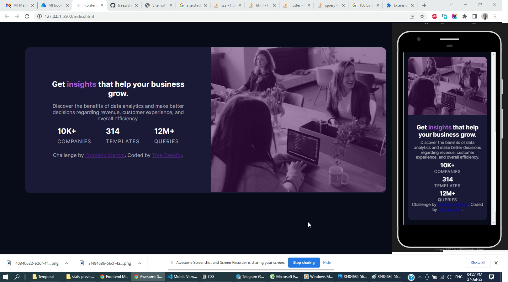

# Frontend Mentor - Stats preview card component solution

This is a solution to the [Stats preview card component challenge on Frontend Mentor](https://www.frontendmentor.io/challenges/stats-preview-card-component-8JqbgoU62). Frontend Mentor challenges help you improve your coding skills by building realistic projects. 

## Table of contents

- [Overview](#overview)
  - [The challenge](#the-challenge)
  - [Screenshot](#screenshot)
  - [Links](#links)
- [My process](#my-process)
  - [Built with](#built-with)
  - [What I learned](#what-i-learned)
  - [Continued development](#continued-development)
  - [Useful resources](#useful-resources)
- [Author](#author)
- [Acknowledgments](#acknowledgments)

## Overview

### The challenge

Users should be able to:

- View the optimal layout depending on their device's screen size

### Screenshot

### Links

- Solution URL: [https://github.com/traez/stats-preview-card-component-main](https://github.com/traez/stats-preview-card-component-main)
- Live Site URL: [https://traez.github.io/stats-preview-card-component-main/](https://traez.github.io/stats-preview-card-component-main/)

## My process

### Built with

- Semantic HTML5 markup
- CSS custom properties
- Flexbox
- Mobile-first workflow

### What I learned

First attempt at responsiveness. Making page change from Mobile to desktop view.  
Twas a real baptism.

### Continued development

Will work to get better at this, executing in the shortest time possible.

### Useful resources

YouTube, Stackoverflow, Google, Frontendmentor Community. Thanks!

## Author

- Website - [Trae Zeeofor](https://github.com/traez)  
- Frontend Mentor - [@traez](https://www.frontendmentor.io/profile/traez)  
- Twitter - [@trae_z](https://twitter.com/trae_z)  

## Acknowledgments

Same as stated in Useful resources. Nuff respect to YouTube, Stackoverflow, Google and the Frontendmentor Community.

